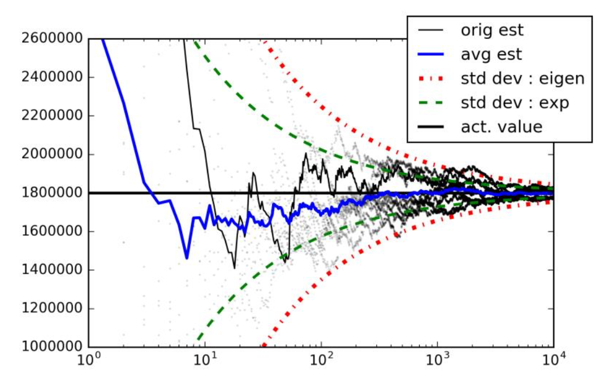

# Estimating graph properties with random walks

## Intro
Counting the number of nodes and edges of a graph is easy right? You just use a package like [NetworkX](https://networkx.github.io/documentation/networkx-1.10/reference/functions.html) and type in 'number_of_nodes(G)'.

Well. Yes, normally. But what about when you can't. What if the graph in question is the entire world wide web, or all videos on youtube. The data may be so large they are not available on any single centralised server, and we might have only partial access to it - we can only view the currenty node that we're on (e.g. the hyperlinks of the current webpage - you need to move to the next webpage before you know which hyperlinks it contains).

So how can we estimate properties of these graphs?

We use __random walks__. Specifically we choose some node to start from, set off on a random walk, and see how long it takes until we return to that node.

_graph of the algorithm figuring out how many edges exist in a massive graph, x axis shows subsquent returns of the random walk_

## An analogy

Imagine you're dropped into a city. You have no idea where you are, no map, and your task is to estimate how many junctions there are in the entire city. You mark your start point so you will know when you return to it, and you set off for a walk. Every time you reach a junction, you flip a coin to decide which direction to follow. Eventually, after some time, you will return to the point you started. Great. Now repeat this many times. And some more. Average those results. Now you reason that the larger a city you're in, the longer the time before returns. So now you just have to figure out the math linking the two things...

## Papers

C. Cooper, T. Radzik, and Y. Siantos, “Fast Low-Cost Estimation of Network Properties Using Random Walks,” Internet Math., vol. 12, no. March, pp. 221–238, 2016.

M. Bawa, H. Garcia-Molina, A. Gionis, and R. Motwani, “Estimating Aggregates on a Peer-to-Peer Network,” Submitt. Publ., pp. 1–13, 2003.

L. Massoulié, E. Le Merrer, A.-M. Kermarrec, and A. Ganesh, “Peer counting and sampling in overlay networks: Random Walk Methods,” Proc. twenty-fifth Annu. ACM Symp. Princ. Distrib. Comput., pp. 123–132, 2006.

D. Aldous and J. A. Fill, Reversible Markov Chains and Random Walks on Graphs. 2002.

J. Leskovec and A. Krevl, “SNAP Datasets: Stanford Large Network Dataset Collection.” 2014.
